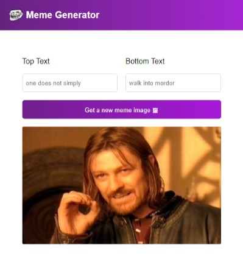

# Meme Generator from Scrimba

This is a project from the [Learn React](https://scrimba.com/learn/learnreact) course from [Scrimba](https://scrimba.com/).

### The challenge

Users should be able to:

- Generate a random meme image by clicking the button
- See the text written in input elements on the meme

### Screenshot



### Links

- [View Code](https://github.com/elizerdim/react-meme-generator)
- [Live Preview](https://react-meme-generator-zeta.vercel.app/)

### Built with

- HTML
- CSS
- React

### What I learned

I completed this project on Scrimba back in September 2023 when I was first learning React and wanted to include it here for reference. When I revisited it on scrimba, there were a11y updates, so I had the chance to learn about and use useId() hook as well.

- ```useId()``` hook can be used to generate id values for ```input``` elements to link them to ```label``` elements
- ```htmlFor``` is used instead of ```for``` attribute in React because for is a reserved word in JavaScript
- An async function cannot be directly passed into useEffect because it automatically returns a Promise, and if a function passed into useEffect should either return nothing or a cleanup function. So the async function should be passed into useEffect inside an anonymous function.
- How to access and use input text value to render it in another element in real time by using state

### Useful resources

- [```useId()``` hook](https://react.dev/reference/react/useId) - React documentation for useId hook
- [meme API](https://api.imgflip.com/get_memes) - API for meme images